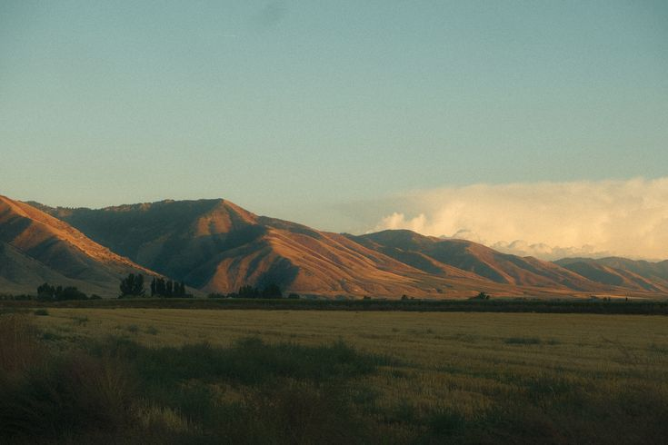
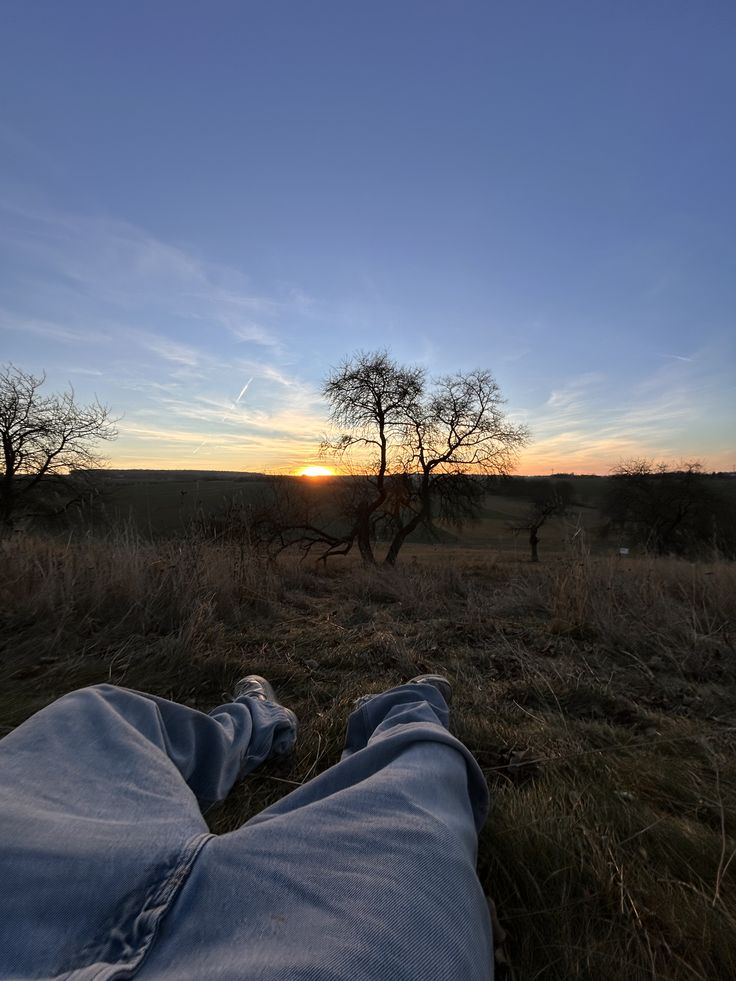

<!--  -->

---

  16 yr old • full-stack developer of 6 years
   
  📧 <code>focat@vnna.gg</code> • 🔗 <code>@focat</code> on discord

---

### ୨୧ ➜ stack

`python` `javascript` `typescript` `luau`
`c#` `c++` `rust`
`html` `css` `react` `next.js` `svelte`

### ୨୧ ➜ backend / infra

`mongodb` `postgres` `sql` `neon`
`linux` `nginx` `cloudflare`

### ୨୧ ➜ tools

`figma` `photoshop` `fl studio` `blender` `ahk` `openiv`

### ୨୧ ➜ learning

`java` `go` `rust` `ruby` `R`
`unity` `unreal engine`

---

  
  

